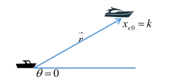
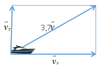
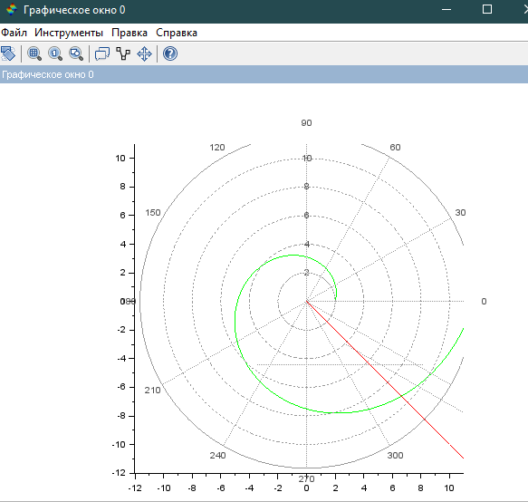
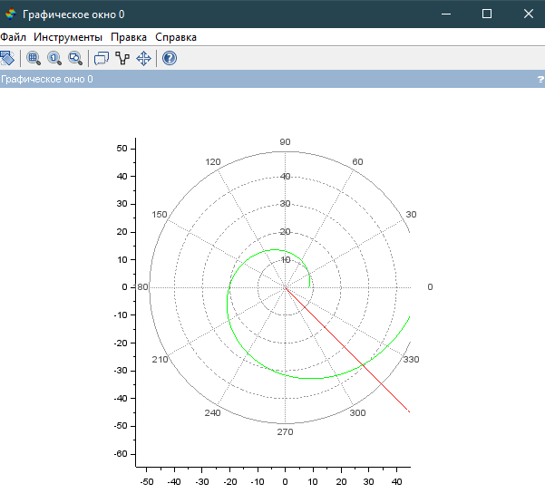
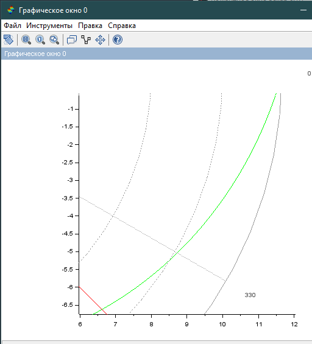
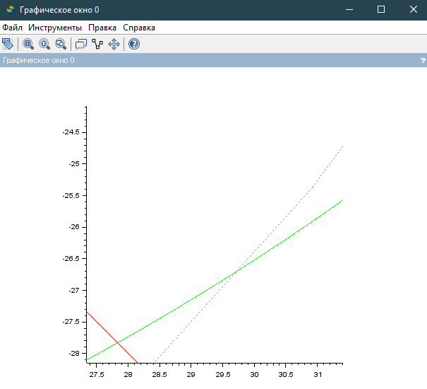

---
# Front matter
lang: ru-RU  
title: "Отчёт по лабораторной работе №2"  
subtitle: "дисциплина: Математическое моделирование"  
author: "Рыбалко Элина Павловна"  

# Generic otions
lang: ru-RU
toc-title: "Содержание"

# Bibliography
bibliography: bib/cite.bib
csl: pandoc/csl/gost-r-7-0-5-2008-numeric.csl

# Pdf output format
toc: true # Table of contents
toc_depth: 2
lof: true # List of figures
lot: true # List of tables
fontsize: 12pt
linestretch: 1.5
papersize: a4
documentclass: scrreprt
## I18n
polyglossia-lang:
  name: russian
  options:
  - spelling=modern
  - babelshorthands=true
polyglossia-otherlangs:
  name: english
### Fonts
mainfont: PT Serif
romanfont: PT Serif
sansfont: PT Sans
monofont: PT Mono
mainfontoptions: Ligatures=TeX
romanfontoptions: Ligatures=TeX
sansfontoptions: Ligatures=TeX,Scale=MatchLowercase
monofontoptions: Scale=MatchLowercase,Scale=0.9
## Biblatex
biblatex: true
biblio-style: "gost-numeric"
biblatexoptions:
  - parentracker=true
  - backend=biber
  - hyperref=auto
  - language=auto
  - autolang=other*
  - citestyle=gost-numeric
## Misc options
indent: true
header-includes:
  - \linepenalty=10 # the penalty added to the badness of each line within a paragraph (no associated penalty node) Increasing the value makes tex try to have fewer lines in the paragraph.
  - \interlinepenalty=0 # value of the penalty (node) added after each line of a paragraph.
  - \hyphenpenalty=50 # the penalty for line breaking at an automatically inserted hyphen
  - \exhyphenpenalty=50 # the penalty for line breaking at an explicit hyphen
  - \binoppenalty=700 # the penalty for breaking a line at a binary operator
  - \relpenalty=500 # the penalty for breaking a line at a relation
  - \clubpenalty=150 # extra penalty for breaking after first line of a paragraph
  - \widowpenalty=150 # extra penalty for breaking before last line of a paragraph
  - \displaywidowpenalty=50 # extra penalty for breaking before last line before a display math
  - \brokenpenalty=100 # extra penalty for page breaking after a hyphenated line
  - \predisplaypenalty=10000 # penalty for breaking before a display
  - \postdisplaypenalty=0 # penalty for breaking after a display
  - \floatingpenalty = 20000 # penalty for splitting an insertion (can only be split footnote in standard LaTeX)
  - \raggedbottom # or \flushbottom
  - \usepackage{float} # keep figures where there are in the text
  - \floatplacement{figure}{H} # keep figures where there are in the text
---

# Цель работы

Рассмотреть построение математических моделей для выбора правильной стратегии решения задач поиска на примере задачи о погоне.  

## Объект исследования

Численные методы решения задачи о погоне.

## Предмет исследования

Вычисление траекторий движения и точек перечения.

# Теоретическое введение

Математическое моделирование социальных, экономических и производственных процессов и систем является одним
из важнейших средств познания природы самых разнообразных систем. Математическое моделирование экономических
процессов ориентировано на системное изучение экономики с
помощью математических моделей микро- и макроуровней, а
также в разрезе важнейших функциональных подсистем экономики.
В настоящее время использование математического моделирования в экономике стало особенно актуальным, так как
деятельность предприятий осуществляется в условиях конкуренции, в которой успеха добиваются те, кто наиболее эффективно использует ресурсы, а также стала доступной вычислительная техника, которая дает возможность реализовывать алгоритмы вычислений любой сложности.
Для внедрения математического моделирования и информационных технологий в практическую деятельность нужны
специалисты, которые, с одной стороны, достаточно глубоко
разбираются в сущности экономических проблем и способны
формализовать возникающие задачи, а с другой – профессионально владеют математическими методами и соответствующим программным обеспечением.
Цель издания учебного пособия – помочь обучающимся
освоить современные математические модели для анализа и
научного прогнозирования поведения экономических объектов
в соответствии с учебной программой дисциплины «Математическое моделирование». [[1]](#список-литературы)

# Задание

[Вариант 21]

На море в тумане катер береговой охраны преследует лодку браконьеров. Через определенный промежуток времени туман рассеивается, и лодка обнаруживается на расстоянии 9,4 км от катера. Затем лодка снова скрывается в тумане и уходит прямолинейно в неизвестном направлении.  Известно, что скорость катера в 3,7 раза больше скорости браконьерской лодки.

1. Запишите уравнение, описывающее движение катера, с начальными условиями для двух случаев  (в зависимости от расположения катера относительно лодки в начальный момент времени).
2. Постройте траекторию движения катера и лодки для двух случаев.
3. Найдите точку пересечения траектории катера и лодки.

# Выполнение лабораторной работы

## 1. Постановка задачи

1.1. Принимает за $t_{0} = 0$, $x_{л0} = 0$ – место нахождения лодки браконьеров в момент обнаружения,
$x_{к0} = k = 9,4$ – место нахождения катера береговой охраны относительно лодки браконьеров в момент обнаружения лодки.

1.2. Введем полярные координаты. Считаем, что полюс – это точка обнаружения лодки браконьеров  $x_{л0} (θ = x_{л0} = 0)$, а полярная ось $r$ проходит через точку нахождения катера береговой охраны (см. рис. -@fig:001).

{ #fig:001 width=70% } 

1.3. Траектория катера должна быть такой, чтобы и катер, и лодка все время были на одном расстоянии от полюса  $θ$, только в этом случае траектория катера пересечется с траекторией лодки. 
Поэтому для начала катер береговой охраны должен двигаться некоторое время прямолинейно, пока не окажется на том же расстоянии от полюса, что и лодка браконьеров. После этого катер должен двигаться вокруг полюса удаляясь от него с той же скоростью, что и лодка браконьеров.

1.4. Чтобы найти расстояние  $x$ (расстояние после которого катер начнет двигаться вокруг полюса), необходимо составить простое уравнение. Пусть через время  $t$ катер и лодка окажутся на одном расстоянии  $x$ от полюса. За это время лодка пройдет  $x$, а катер  $k-x$ (или  $k+x$, в зависимости от начального положения катера относительно полюса). Время, за которое они пройдут это расстояние, вычисляется как  $x/v$ или $k - x / 3.7v$  (во втором случае $k + x / 3.7v$). 
Так как время одно и то же, то эти величины одинаковы. Тогда неизвестное расстояние $x$ можно найти из следующего уравнения:
$\frac{x}{v} = \frac{k - x}{3.7v}$ в первом случае или 
 $\frac{x}{v} = \frac{k + x}{3.7v}$ во втором случае.
Отсюда мы найдём два значения $x_1 = \frac{k - x}{3.7} = \frac{k}{4.7} = \frac{9,4}{4.7} = 2$  и $x_2 = \frac{k + x}{3.7} = \frac{k}{2.7} ≈ 3,481$, задачу будем решать для двух случаев.

1.5. После того, как катер береговой охраны окажется на одном расстоянии от полюса, что и лодка, он должен сменить 
прямолинейную траекторию и начать двигаться вокруг полюса удаляясь от него со скоростью лодки $v$.
Для этого скорость катера раскладываем на две составляющие: $v_r$ - радиальная скорость и $v_τ$ - тангенциальная скорость.
Радиальная скорость - это скорость, с которой катер удаляется от полюса, $v_r = \frac{dr}{dt}$. Нам нужно, чтобы эта скорость 
была равна скорости лодки, поэтому полагаем $\frac{dr}{dt}$ = $v$.
Тангенциальная скорость – это линейная скорость вращения катера относительно полюса. Она равна произведению 
угловой скорости $\frac{dθ}{dt}$ на радиус $r$, $v_τ = r \frac{dθ}{dt}$.

{ #fig:002 width=70% } 

Из рисунка -@fig:002 видно: $v_τ = \sqrt{13,69 v^2 - v^2} = \sqrt{12,69}v$ (учитывая, что радиальная скорость равна $v$). 
Тогда получаем $r \frac{dθ}{dt} = \sqrt{12,69}v$.

1.6. Решение исходной задачи сводится к решению системы из двух дифференциальных уравнений 
$$
\left\{ 
\begin{array}{c}
\frac{dr}{dt} = v  \\ 
r \frac{dθ}{dt} = \sqrt{12,69}v
\end{array}
\right. 
$$ 
с начальными условиями 
$$\left\{ 
\begin{array}{c}
θ_0 = 0 \\ 
r_0 = x_1
\end{array}
\right. 
$$ или $$\left\{ 
\begin{array}{c}
θ_0 = -π \\ 
r_0 = x_2
\end{array}
\right. 
$$

Исключая из полученной системы производную по $t$, можно перейти к следующему уравнению: $\frac{dr}{dθ}$ = $\frac{r}{\sqrt{12,69}}$. 
Начальные условия остаются прежними. Решив это уравнение, мы получим траекторию движения катера в полярных координатах.

## 2. Построение траекторий движения катера и лодки 

### 2.1. Листинг программы в Scilab

```
s=9.4; //начальное расстояние от лодки до катера
fi=3*%pi/4;

//функция, описывающая движение катера береговой охраны
function dr=f(tetha, r)
  dr=r/sqrt(12.69);
endfunction;

//начальные условия в случае 1
r0=s/4.7;
tetha0=0;

//начальные условия в случае 2
//r0=s/2.7;
//tetha0=-%pi;
tetha=0:0.01:2*%pi;
r=ode(r0,tetha0,tetha,f);

//функция, описывающая движение лодки браконьеров
function xt=f2(t)
 xt=tan(fi)*t;
endfunction

t=0:1:800;

polarplot(tetha,r,style = color('green')); //построение траектории движения катера в полярных координатах
plot2d(t,f2(t),style = color('red')); //построение траектории движения лодки браконьеров 
```

### 2.2. Полученные графики  
После запуска кода программы получили чледующие графики для первого и второго случая соответственно  (см. рис. -@fig:003 и -@fig:004).

{ #fig:003 width=70% } 

{ #fig:004 width=70% } 

## 3. Нахождение точек пересечения катера и лодки 

### Найденные точки пересечения катера и лодки для двух случаев:

3.1. Для первого случая точка пересечения имеет примерные координаты (6,65; -6,65) (см. рис. -@fig:005). 

{ #fig:005 width=70% } 

3.2. Для второго случая точка пересечения имеет примерные координаты (27,8; -27,8) (см. рис. -@fig:006).

{ #fig:006 width=70% } 

# Вывод

Рассмотрели построение математических моделей для выбора правильной стратегии решения задач поиска на примере задачи о погоне. 

# Список литературы {.unnumbered}

1. [Руководство по формуле Cmd Markdown](https://russianblogs.com/article/26051452570/)
2. [Математическое моделирование при решении задач](https://urok.1sept.ru/articles/609795)
3. [С.В. Каштаева, Математическое моделирование / Учебное пособие](http://pgsha.ru:8008/books/study/%CA%E0%F8%F2%E0%E5%E2%E0%20%D1.%20%C2.%20%CC%E0%F2%E5%EC%E0%F2%E8%F7%E5%F1%EA%EE%E5%20%EC%EE%E4%E5%EB%E8%F0%EE%E2%E0%ED%E8%E5..pdf)
4. [Руководство по оформлению Markdown файлов](https://gist.github.com/Jekins/2bf2d0638163f1294637)